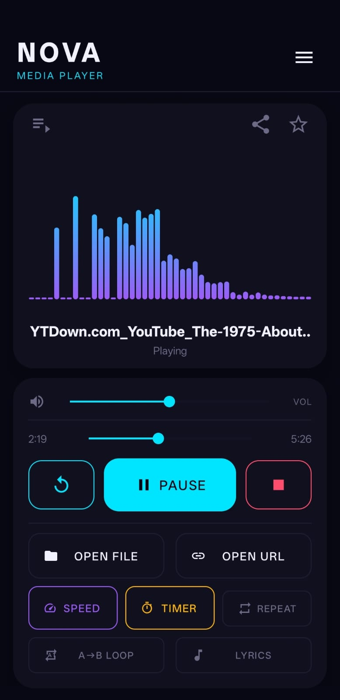
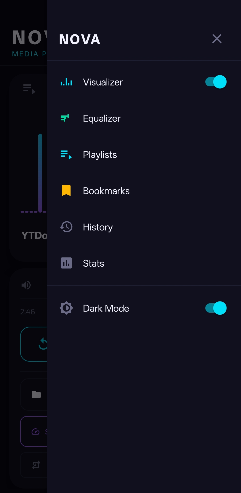
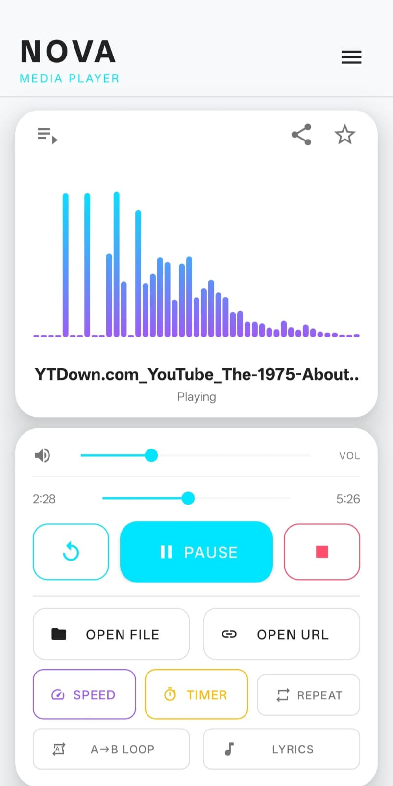
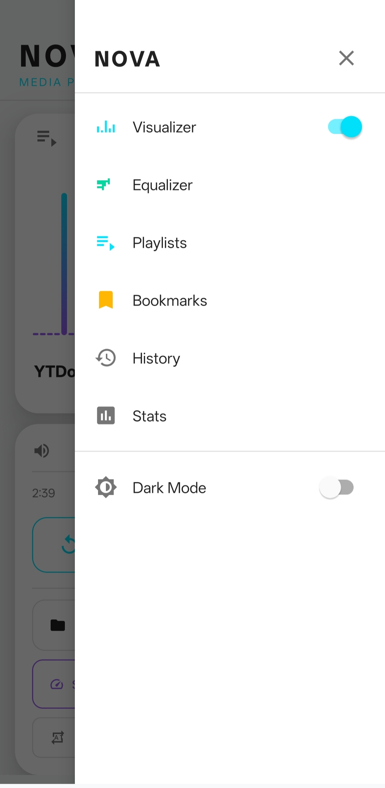

<div align="center">

# NovaPlayer — A Kotlin-based Android media player

<br/>


-blue?style=for-the-badge)
-brightgreen?style=for-the-badge)


<br/>

> *Started as a basic university assignment. Evolved into something much bigger.*

<br/>

</div>

---

## What is NOVA Player?

NOVA Player is a full-featured Android media player that supports **local audio**, **direct video streaming**, all from a single app. It's built with modern Android architecture: a `Room` database, a background `MediaSession` service, `ExoPlayer` for video, real-time FFT visualization, auto-fetched synced lyrics, a 5-band equalizer, and 25+ features that make it feel like a production-ready application.

---
## 📸 Preview

> NovaPlayer v2 interface — dark and light themes


### 🌙 Dark Mode
<p align="center">
  
  
</p>

### ☀️ Light Mode
<p align="center">
  
  
</p>

---

## Features

### Playback
- **Local audio** — open any MP3, FLAC, AAC, OGG, or WAV file from device storage
- **Video streaming** — stream MP4, HLS (`.m3u8`), DASH (`.mpd`), and RTSP URLs with `ExoPlayer`
- **Background playback** — audio keeps playing when the screen locks or you switch apps, powered by a foreground `Service`
- **Lock-screen & notification controls** — previous, play/pause, and next buttons in the notification shade and on the lock screen via `MediaSession`
- **Audio focus handling** — automatically pauses when a phone call arrives, resumes after

### Playlist Manager
- Create unlimited named playlists stored in a local `Room` database
- Add single or multiple audio files at once
- Play any playlist from any starting track
- Spotify-style list UI with icon cards and track counts
- Deleting a playlist removes all its tracks (cascade delete)

### Equalizer & Audio
- **5-band equalizer** — 60 Hz, 230 Hz, 910 Hz, 3.6 kHz, 14 kHz, built on Android's native `Equalizer` API
- **6 presets** — Flat, Bass Boost, Treble, Rock, Pop, Jazz
- **Bass Boost** — adjustable strength slider
- **3D Virtualizer** — surround-sound effect
- **Playback speed** — 0.5× to 2.0× in six steps, works for both audio and video

### Lyrics
- **Auto-fetch** — synced `.lrc` lyrics are fetched automatically from [LrcLib.net](https://lrclib.net) when a song starts (free, no API key required)
- **Time-synced highlight** — the current line fades in and out in sync with the music
- **Manual load** — load your own `.lrc` file from storage as a fallback

### Visualizer
- **Real FFT spectrum** — 40 gradient bars that react to actual audio output using Android's `Visualizer` API
- **Cyan → purple gradient** — colour shifts across the frequency spectrum
- **Animated wave bars** — 14-bar staggered animation shown when the visualizer is off
- Toggle on/off instantly from the side menu, takes effect immediately

### Bookmarks
- Tap the ⭐ star on the player card to bookmark the current track at its current timestamp
- Star turns gold when bookmarked, outline when not
- View all bookmarks from the side menu — tap any to jump straight to that position
- Delete all bookmarks at once

### History
- Saves the last 20 played audio files automatically
- Full-page history screen with a card list and empty state
- Tap any item to replay it instantly
- Clear history with a single button

### Listening Stats
- **Today**, **this week**, and **all-time** listening durations — tracked per session
- **Streak counter** 🔥 — counts consecutive days you've listened
- **Top 5 tracks** — most-played songs with a visual bar chart
- Displayed in a 4-card grid layout

### Sleep Timer
- Set auto-stop for 5, 10, 15, 30, or 60 minutes
- Live countdown shown in the top bar, turns red in the final 60 seconds

### Video
- **Fullscreen mode** — tap ⛶ to open a dedicated landscape player with full ExoPlayer controls
- **Resume on exit** — video picks up from the exact position when you leave fullscreen
- **Picture-in-Picture** — press Home during video to float a mini-player (Android 8.0+)

### Other
- **A-B loop** — set a start and end point to loop a specific section of audio
- **Repeat modes** — Off, Repeat One, Repeat All
- **Playback queue** — shows what's playing and what's next, tap any track to jump to it
- **Volume slider** — in-app volume control that syncs with hardware buttons in real time
- **Share** — share the currently playing audio file to any app
- **Dark / Light theme** — toggle from the side menu, applied instantly without freezing
- **Haptic feedback** — subtle vibration on every button tap
- **Entrance animations** — cards slide up with a fade-in on launch

---

## Architecture

```
com.example.mediaplayer/
│
├── MainActivity.kt                  ← All UI + feature orchestration
│
├── service/
│   └── MusicService.kt              ← Background playback, MediaSession,
│                                       AudioFocus, 5-band EQ, BassBoost
│
├── db/
│   ├── AppDatabase.kt               ← Room database singleton
│   ├── dao/Daos.kt                  ← PlaylistDao, BookmarkDao, StatsDao
│   └── entity/Entities.kt           ← Playlist, PlaylistItem, Bookmark, PlayStat
│
├── ui/
│   ├── PlaylistActivity.kt          ← Playlist list + track management
│   ├── EqualizerActivity.kt         ← Full-screen EQ with presets
│   ├── HistoryActivity.kt           ← Recently played full-page view
│   ├── StatsActivity.kt             ← Listening stats card grid
│   ├── FullscreenVideoActivity.kt   ← Landscape video player
│   └── VisualizerView.kt            ← Custom FFT canvas view
│
└── util/
    ├── StatsManager.kt             ← SharedPrefs listening time tracker
    ├── LyricsParser.kt             ← LRC format parser + LrcLib.net API
    └── HapticHelper.kt             ← Vibration feedback wrapper
```

---

## Tech Stack

| Library | Version | Purpose |
|---|---|---|
| Kotlin | 1.9.22 | Primary language |
| Media3 ExoPlayer | 1.3.1 | Video streaming (HLS, DASH, MP4) |
| AndroidYouTubePlayer | 12.1.0 | YouTube URL playback |
| Room | 2.6.1 | Local database (playlists, bookmarks, stats) |
| DrawerLayout | 1.2.0 | Side navigation drawer |
| Material Components | 1.11.0 | UI components |
| Coroutines | 1.7.3 | Async database operations |
| SplashScreen API | 1.0.1 | Animated app launch screen |
| androidx.media | 1.7.0 | MediaSession notification style |

---

## Getting Started

### Requirements
- Android Studio **Hedgehog (2023.1.1)** or newer
- Android SDK 34
- A device or emulator running **Android 7.0 (API 24)** or higher

### Run It

```bash
# 1. Clone the repo
git clone https://github.com/YOUR_USERNAME/NovaPlayer.git

# 2. Open in Android Studio
#    File → Open → select the NovaPlayer/ folder

# 3. Let Gradle sync (downloads all dependencies automatically)

# 4. Hit Run ▶
```

### Permissions

The app requests these at runtime:

| Permission | Why |
|---|---|
| `READ_MEDIA_AUDIO` | Open audio files from storage |
| `RECORD_AUDIO` | Real-time FFT audio visualizer |
| `POST_NOTIFICATIONS` | Show media controls in notification shade (Android 13+) |

---

## Project Stats

| Metric | Count |
|---|---|
| Kotlin files | 15 |
| XML layout files | 11 |
| Vector drawables | 37 |
| Room entities | 4 |
| Activities | 6 |
| Min SDK | API 24 (Android 7.0) |

---

## Author

**Name:** [Aryan Bhati]  

---

## License

```
MIT License — feel free to use, modify, and distribute.
```

---

<div align="center">

Built with Kotlin · NOVA Player v2.0

</div>
